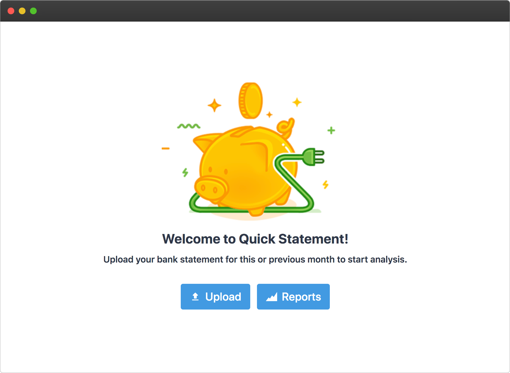
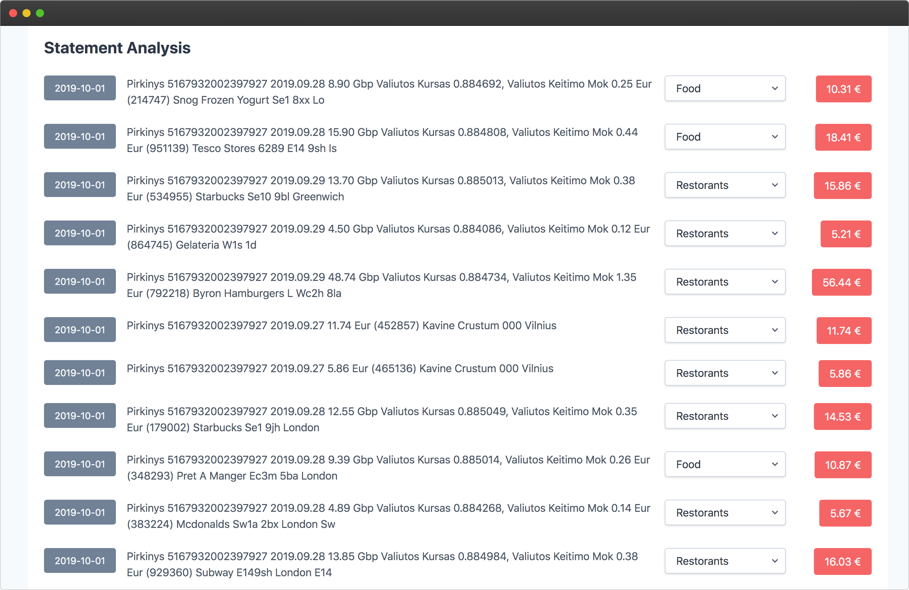
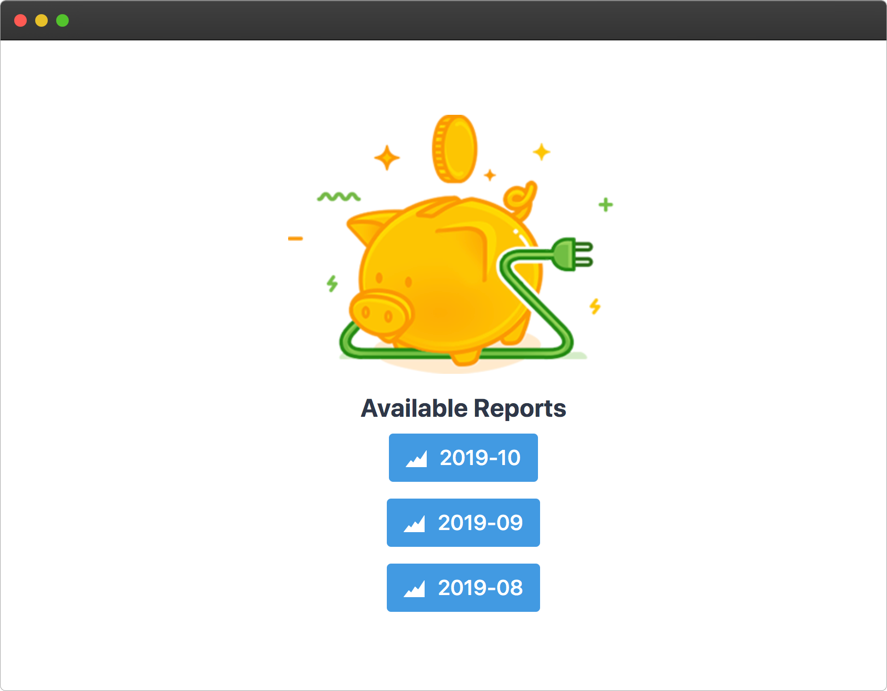
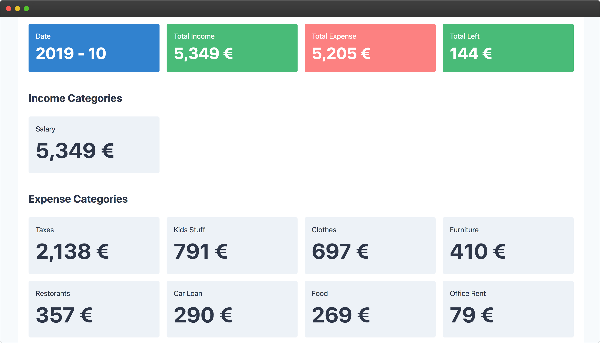

# Quick Statement App

App built with Vue to quickly record income/expenses for every month.

Once you upload your bank statement CSV file, then [API](https://github.com/ReekenX/quick-statement-api) will analyze it and will map every line to some category. At first you will have to do this manually (for first statement or part of first statement). This API learns over time and improves its accuracy to bind categories on its own.

Built with NuxtJS so supports server side rendering.

Built with TailwindCSS so wrote just 2 lines of CSS. Mobile first APP.

## Screenshots

## Installing

In order to launch this project you will need Docker with Docker Compose.

Setup and launch API project:

    git clone https://github.com/ReekenX/quick-statement-api.git
    cd quick-statement-api
    docker-compose -f docker-compose.yml -f docker-compose.dev.yml up --build

Setup and launch APP project:

    git clone https://github.com/ReekenX/quick-statement-app.git
    cd quick-statement-app
    docker-compose up --build

After a minute or two project will be up and running on `http://localhost:3000`.

